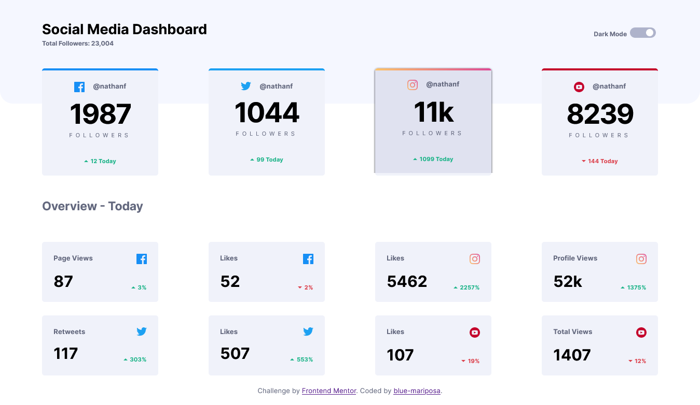
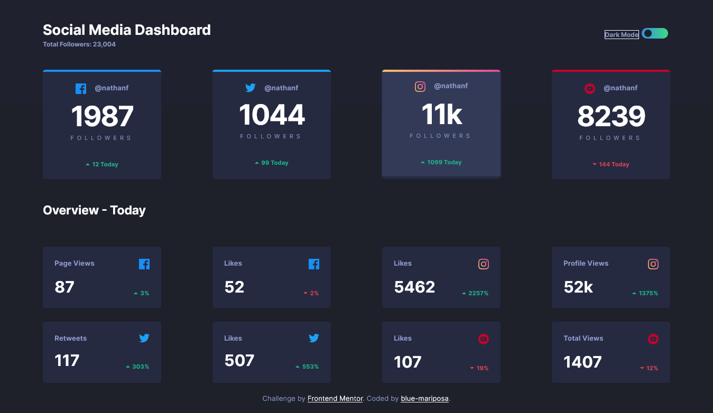
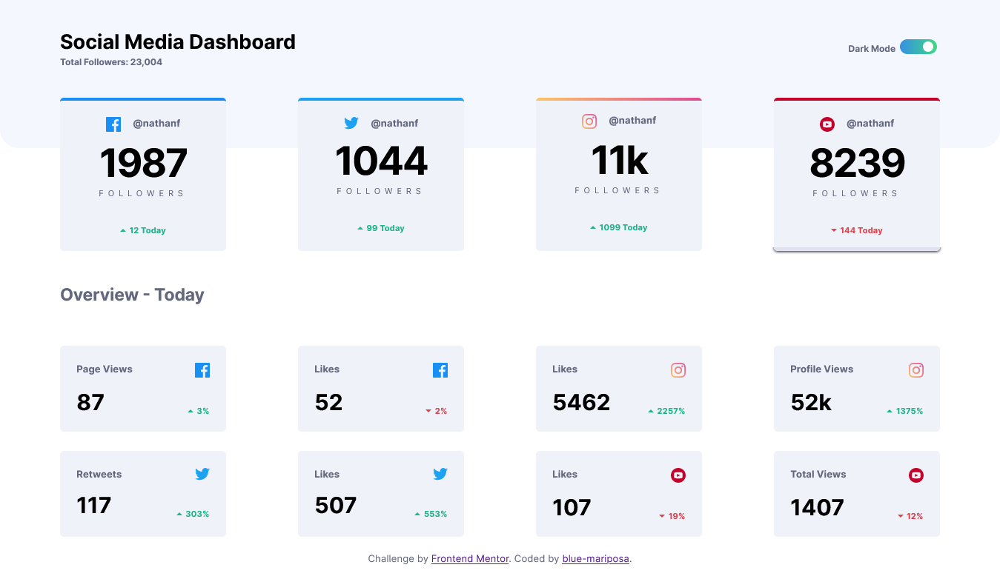
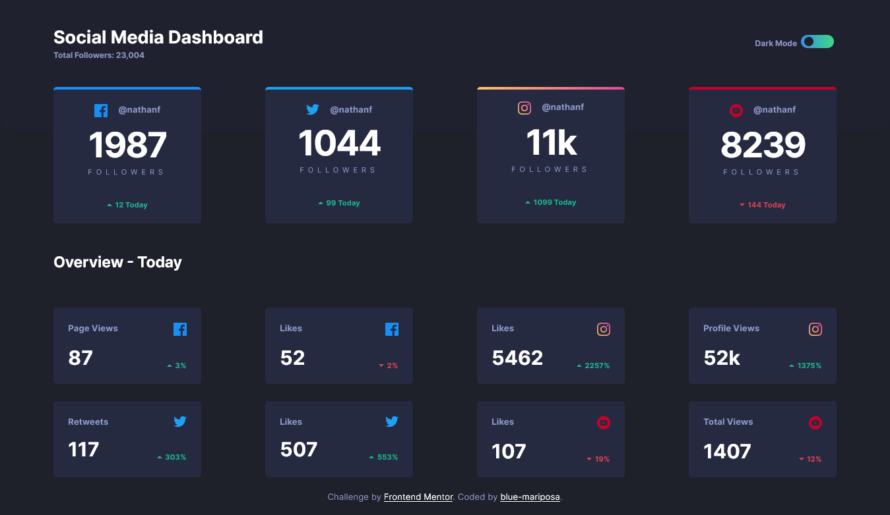
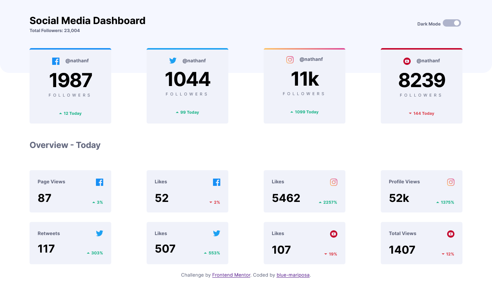
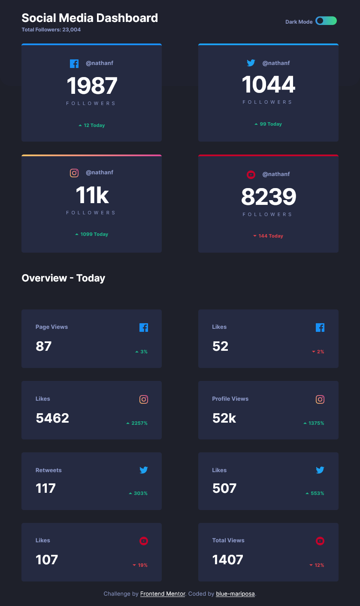
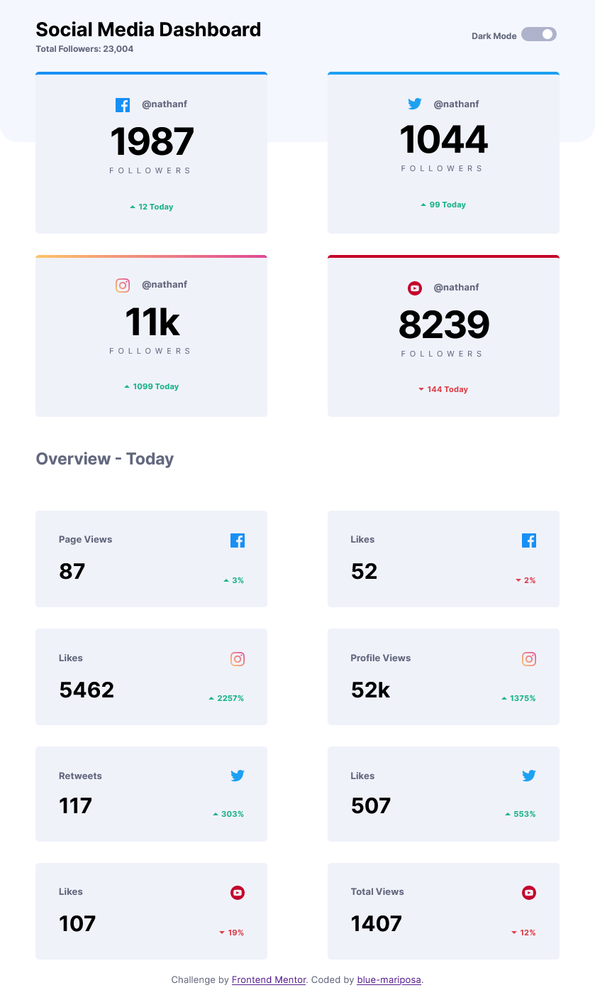

# Frontend Mentor - Social media dashboard with theme switcher solution

This is a solution to the [Social media dashboard with theme switcher challenge on Frontend Mentor](https://www.frontendmentor.io/challenges/social-media-dashboard-with-theme-switcher-6oY8ozp_H). Frontend Mentor challenges help you improve your coding skills by building realistic projects. 

## Table of contents

- [Overview](#overview)
  - [Screenshot](#screenshot)
- [My process](#my-process)
  - [Built with](#built-with)
  - [What I learned](#what-i-learned)
  - [Continued development](#continued-development)
  - [Useful resources](#useful-resources)
- [Author](#author)
- [Acknowledgments](#acknowledgments)

## Overview

This social-media-dashboard-with-theme-switcher chllenge was built with accessibility in mind. HTML, CSS and JavaScript was used in the development. When page loads, the toggle function is ran which checks if the "dark mode" buton is activated or not and changes the color-scheme accordingly. Also, the same function is ran when the toggle button is clicked. The keyboard can be used to tab through he cards and also toggle the button when the "Enter" key is pressed.

### Screenshot











## My process
- Took notes of the requirements of the project and research needed.
<!-- - Research on creating toggle buttons and changing color-scheme based on browser theme settings. I didnot implement this in this project but have provided links below to the research. -->
- Ceated the folder structure with all the files / assets needed.
- Planned the classes / Id and elements to use.
  - CSS variables / customproperties to use.
- Downloaded the google fonts.
- Wrote HTML, CSS and JvaScript.
  - Added tab, focus state and enter key functionality.
- Refactored the CSS. Made the code easy to read and understand
      

### Built with

- Semantic HTML5 markup
- CSS custom properties
- Flexbox
- Grid
- JavaScript
- Mozilla Firefox
- Microsoft Egde
- VS-Code

### What I learned

- Using "prefers-color-scheme" in JavaScript and CSS.
- Learning to use AdobeXD.
- Creating a Multi-toggle switch / button.
- Hide HTML5 elements from screen readers.
- Testing / debugging code in browser console.

# Code i'm proud of
```CSS
  /* Switch / Toggle box (pill-shape) */
  .switch label::before {
      background-color: var(--toggle-light);
      border-radius: 10px;
      bottom: 0;
      content: "";
      height: 20px;
      left: 110%;
      position: absolute;
      width: 50px;
  }

  .switch label:hover::before {
      background-image: var(--toggle-dark);
  }

  /* Toggle inner button */
  .switch label::after {
      background-color: var(--white-color);
      border-radius: 50%;
      content: "";
      height: 14px;
      left: 115%;
      position: absolute;
      top: calc((20px - 14px) / 2);
      transform: translate(27px, -5.5px);
      transition: 
          transform 500ms ease,
          background-color 500ms ease
      ;
      width: 14px;
  }

  /* Move button when toggle clicked */
  .switch input:checked + label::after{
      transform: translate(1px, -5.5px);
      background-color: var(--bg-dark);
  }
```

```js
function darkBtnToggle(n) {
    if(checkbox.checked){
        setTimeout(() => {
            body.classList.add("dark");
        }, n);
        
    } else {
        setTimeout(() => {
            body.classList.remove("dark");
        }, n);
    }
}
```

### Continued development

- Learn more accessiblity features.
- Learn about "aria-" & "data-" attributes.
- Implement (prefers-color-scheme) theme switch on browser theme change.

### Useful resources

- [Javscript references](https://developer.mozilla.org/en-US/docs/Web/Accessibility/ARIA/Attributes/aria-label) ARIA attributes.

- [CSS references](https://developer.mozilla.org/en-US/docs/Web/CSS/@media/prefers-color-scheme) Prefers-color-scheme.

- [Google fonts](https://fonts.google.com/) - Google fonts.

- [W3schools.com](https://www.w3schools.com/).

- [color](https://color.adobe.com/create/color-wheel).

- [color](https://colorhunt.co/).


## Author

- Frontend Mentor - [@Asadsaleem123](https://www.frontendmentor.io/profile/Asadsaleem123).

## Acknowledgments

- Thanks to Frontend Mentor for the guide(s) [Link](https://www.frontendmentor.io).

- Dr. Angela Yu [The Complete 2022 Web Development Bootcamp](https://www.udemy.com/course/the-complete-web-development-bootcamp/).

- Developers of MDN Web Docs [MDN Web Docs](https://developer.mozilla.org/en-US/).
